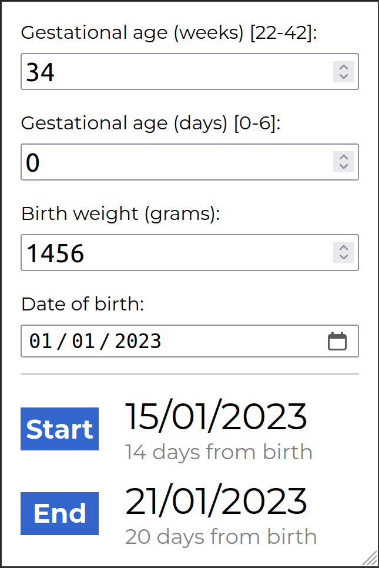

# ROP Calculator

A port of the [Screening of retinopathy of prematurity](https://www.rcpch.ac.uk/resources/screening-retinopathy-prematurity-rop-clinical-guideline) Excel spreadsheet as an HTML embed for the RCPCH site.

[The original Excel sheet](https://www.rcpch.ac.uk/sites/default/files/2023-10/nnap_rop_screening_calculator_v2.0.xlsx)

> [!WARNING]  
> Not yet live on rcpch.ac.uk

## Setup

- Install Python
- Run `s/up`
- Visit `http://localhost:9001`

Refresh the page to see changes.

